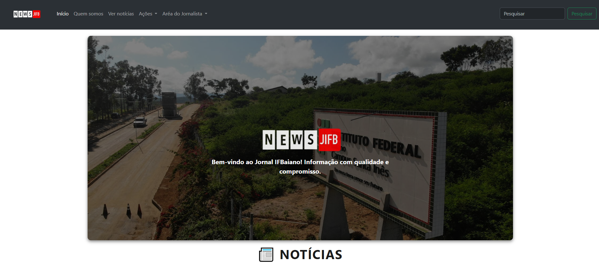

# Jornal IF Baiano

> O JIFB é um projeto de um site onde será mostrada inicialmente notícias sobre e para o meu Campus do Instituto Federal Baiano.

### Ajustes e melhorias

O projeto ainda está em desenvolvimento e as próximas atualizações serão voltadas para as seguintes tarefas:

- [x] Conseguir publicar matérias
- [x] Conseguir editar as matérias
- [x] Conseguir exlcuir as matérias
- [x] Sistema de Login
- [x] Comentários nas notícias
- [x] Respostas nos comentários

## 🤝 Contribuidor 

Agradecemos a seguinte pessoa que contribuiu para este projeto:

<table>
  <tr>
    <td align="center"> 
      <a href="https://github.com/Ghs-d" title="Front-End Developer"> 
      
        
       
        <b>
          Guilherme
        </b> 
       
    </a> 
    </td>
  </tr>
</table>
