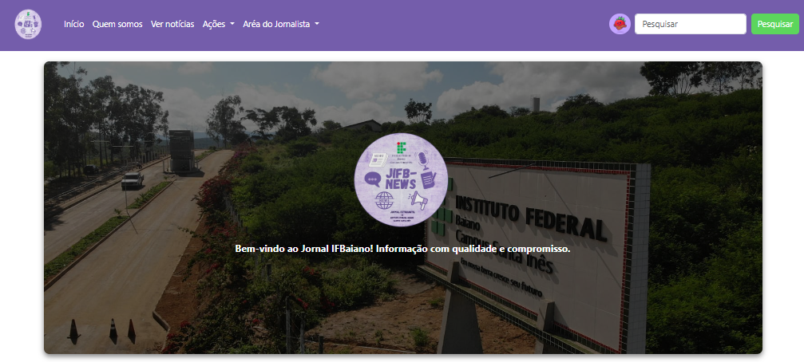

# news-site

> O news-site é um projeto de um site onde será mostrada inicialmente notícias sobre e para o meu Campus do Instituto Federal Baiano.

## 🤝 Contribuidor 

Agradecemos a seguinte pessoa que contribuiu para este projeto:

<table>
  <tr>
    <td align="center"> 
      <a href="https://github.com/SilasAndradev" title="Back-End Developer"> 
      
        
       
        <b>
          Silas
        </b> 
       
    </a> 
    </td>
    <td align="center"> 
      <a href="https://github.com/Ghs-d" title="Front-End Developer"> 
      
        
       
        <b>
          Guilherme
        </b> 
       
    </a> 
    </td>
  </tr>
</table>
